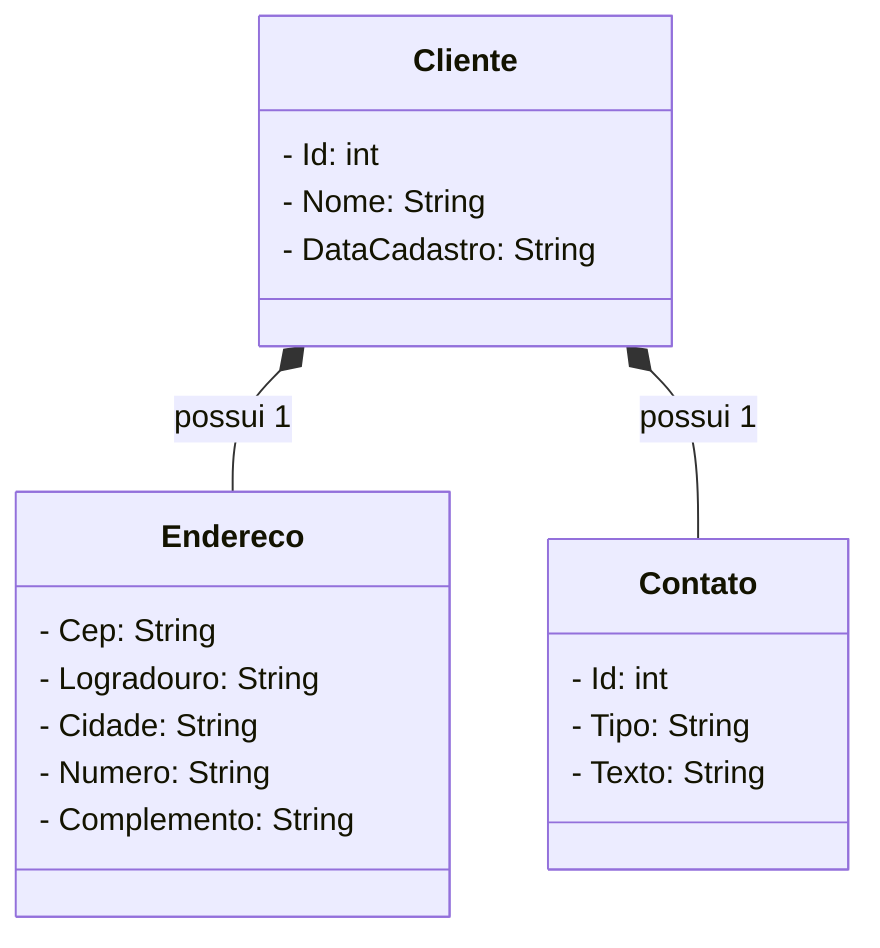
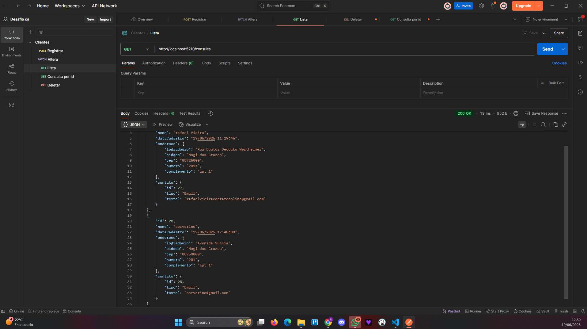
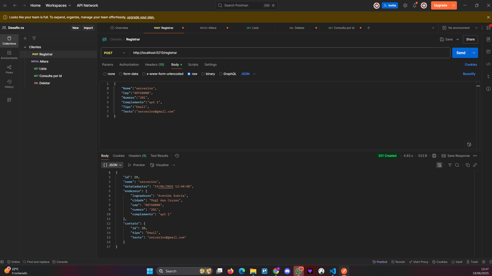
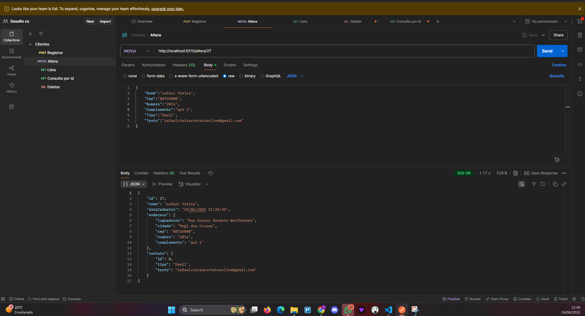
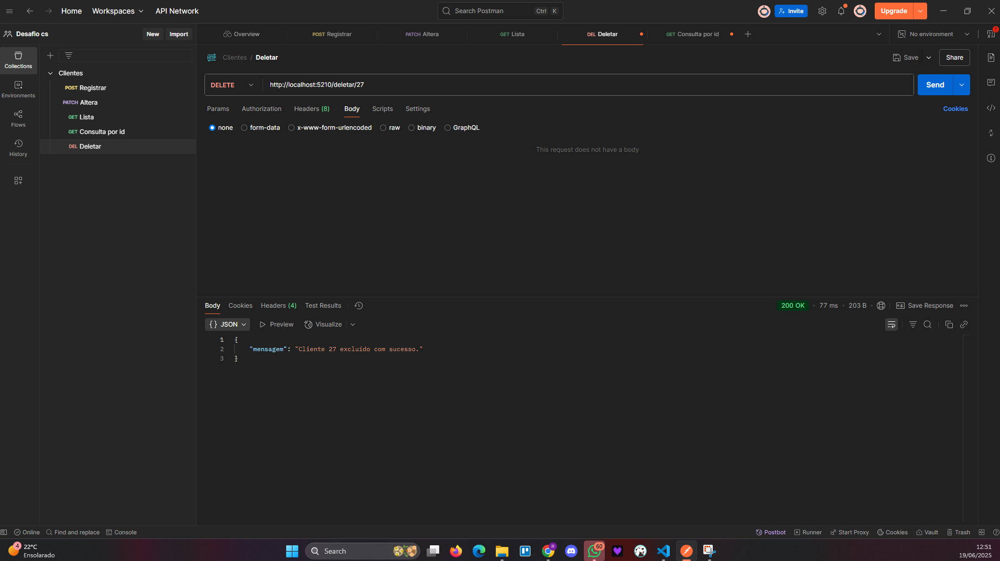

# Desafio Muralis

📖 **Índice**

- [💡 Introdução](#💡-introducao)
- [❗ Problemática](#❗-problematica)
- [🗂️ Modelagem](#🗂️-modelagem)
- [📜 Regras de Negócio](#📜-regras-de-negocio)
- [🛠️ Tecnologias e Padrões Requeridos](#🛠️-tecnologias-e-padroes-requeridos)
- [✅ Testes](#✅-testes)
- [🚀 Manual de Inicialização](#🚀-manual-de-inicializacao)
- [🧪 Endpoints Esperados (exemplos)](#🧪-endpoints-esperados-exemplos)
- [📷 Exemplos de Requisições (Postman)](#📷-exemplos-de-requisicoes-postman)
- [📬 Contato](#📬-contato)

---

## 🏷️ Repositório

```bash
# Clone do projeto

git clone https://github.com/rafaelrvs/desafio.git
cd desafio
```

## 🛠️ Ferramentas Utilizadas

- .NET Core
- Entity Framework Core
- Swagger / OpenAPI
- Postman
- Visual Studio Code

---

## 💡 Introdução

Este projeto foi apelidado de **Desafio Muralis** por se tratar de um dos desafios técnicos propostos pela empresa **Muralis Tecnologia**.\
O objetivo principal é avaliar as habilidades de desenvolvimento **Back-End com C#** e a utilização da **plataforma .NET Core** por meio da criação de uma API RESTful para gerenciamento de clientes.

---

## ❗ Problemática

Criar uma solução em .NET Core que permita:

- ✅ Cadastrar clientes
- ✅ Consultar um cliente por ID
- ✅ Listar todos os clientes
- ✅ Pesquisar clientes por nome
- ✅ Alterar dados de um cliente
- ✅ Excluir um cliente

A implementação deve seguir a seguinte modelagem de dados:


## 🗂️ Modelagem




> 🔎 Obs: A estrutura acima sugere que **um cliente possui exatamente um endereço e um contato**.


## 📜 Regras de Negócio

- Ao cadastrar um cliente com **CEP informado**, deve-se:
  - Consultar a API pública [ViaCEP](https://viacep.com.br/) (ou similar);
  - Utilizar os dados retornados para preencher os campos do endereço;
  - Persistir os dados do endereço no banco de dados.

---


> 🔎 Obs: A estrutura acima sugere que **um cliente possui exatamente um endereço e um contato**.

---

## 📜 Regras de Negócio

- Ao cadastrar um cliente com **CEP informado**, deve-se:
  1. Consultar a API pública [ViaCEP](https://viacep.com.br/)
  2. Preencher os campos de `ClienteEndereco` com os dados retornados
  3. Persistir endereço e contato no banco de dados

---

## 🛠️ Tecnologias e Padrões Requeridos

- Estrutura RESTful
- DTOs (Data Transfer Objects)
- AutoMapper
- Entity Framework Core (com Migrations)
- Minimal APIs  

---

---

## 🚀 Manual de Inicialização

1. **Pré-requisitos:**
   - .NET SDK 6.0 ou superior
   - SQL Server (ou SQLite, conforme configuração)
2. **Clone o repositório:**
   ```bash
   git clone https://github.com/rafaelrvs/desafio.git
   cd desafio
   ```
3. **Configurar banco de dados:**
   - Ajuste a string de conexão em `appsettings.json`
4. **Restaurar pacotes NuGet:**
   ```bash
   dotnet restore
   ```
5. **Aplicar Migrations:**
   ```bash
   dotnet ef database update
   ```
6. **Executar aplicação:**
   ```bash
   dotnet run
   ```
7. **Acessar documentação Swagger:**\
   Navegue até `https://localhost:5210/swagger`

---

## 🧪 Endpoints Esperados (exemplos)

| Método | Rota             | Descrição                |
| ------ | ---------------- | ------------------------ |
| GET    | `/consulta`      | Listar todos os clientes |
| GET    | `/consulta/{id}` | Buscar cliente por ID    |
| POST   | `/registrar`     | Cadastrar novo cliente   |
| PATCH  | `/altera/{id}`   | Atualizar cliente        |
| DELETE | `/deletar/{id}`  | Excluir cliente          |

---

## 📷 Exemplos de Requisições (Postman)

### Listar Clientes

```
http://localhost:5210/consulta
```



### Consultar Cliente por ID

```
http://localhost:5210/consulta/28
```


### Registrar Cliente
```
http://localhost:5210/registrar
```

```
{
    "Nome":"serverino",
    "Cep":"08750000",
    "Numero":"201",
    "Complemento":"apt 1",
    "Tipo":"Email",
    "Texto":"serverino@gmail.com"
}
```


### Alterar Cliente

```
http://localhost:5210/altera/30
```
```
{
    "Nome":"serverino da silva",
    "Cep":"08750000",
    "Numero":"300",
    "Complemento":"apt 105",
    "Tipo":"Email",
    "Texto":"serverino@gmail.com"
}
```




### Deletar Cliente
```
http://localhost:5210/deletar/1
```



---
## 📬 Contato

Dúvidas ou sugestões? Entre em contato  via [linkedin](linkedin\:https://www.linkedin.com/in/rafaelrvs/).

